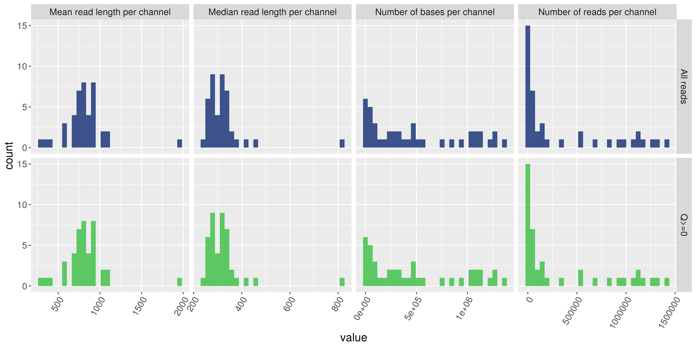
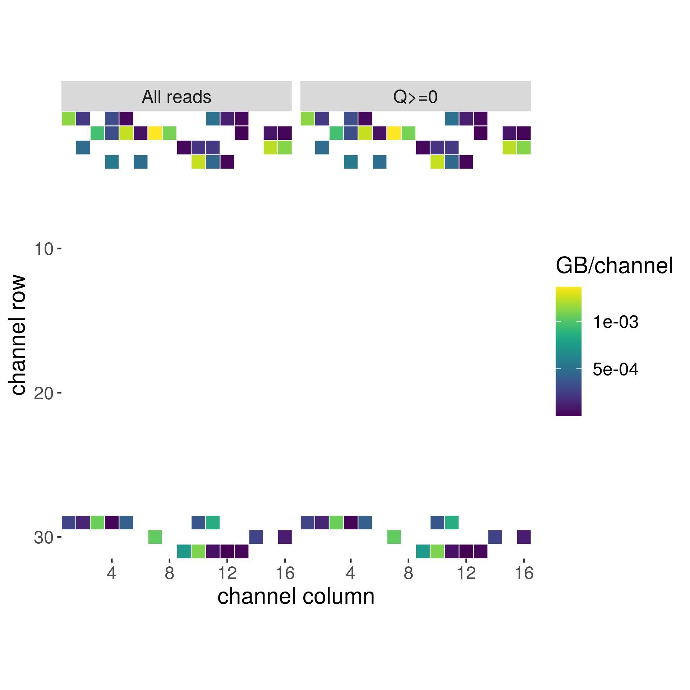
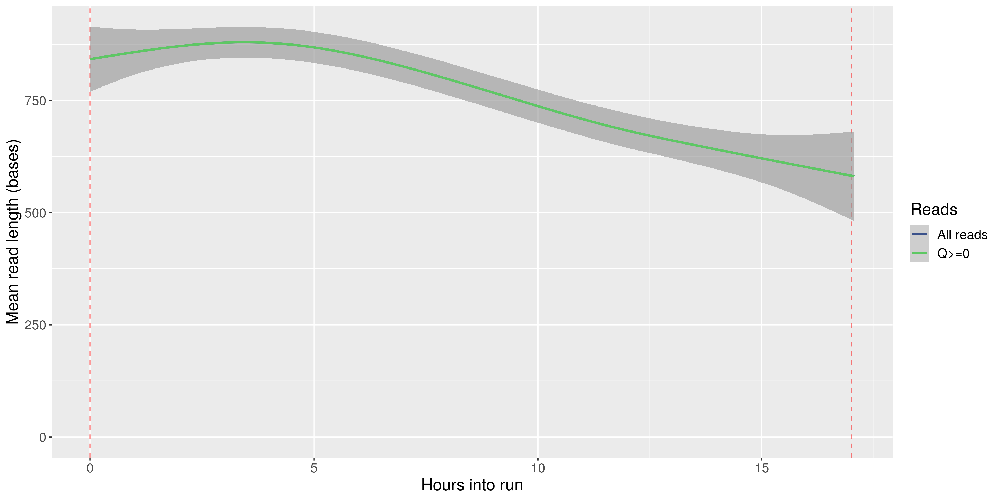
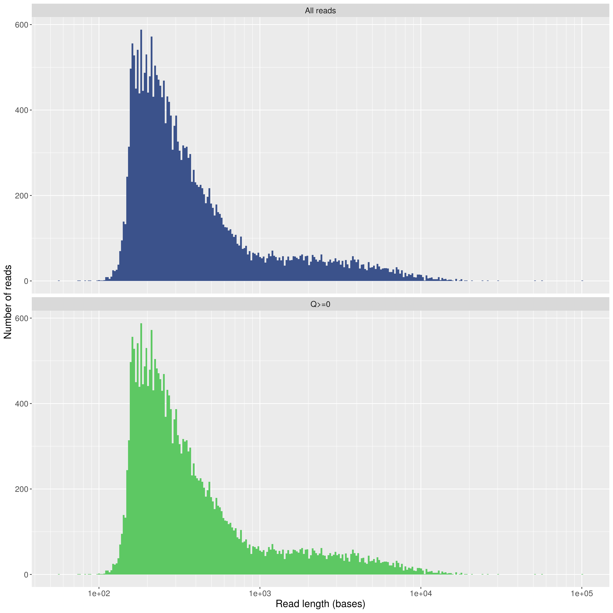
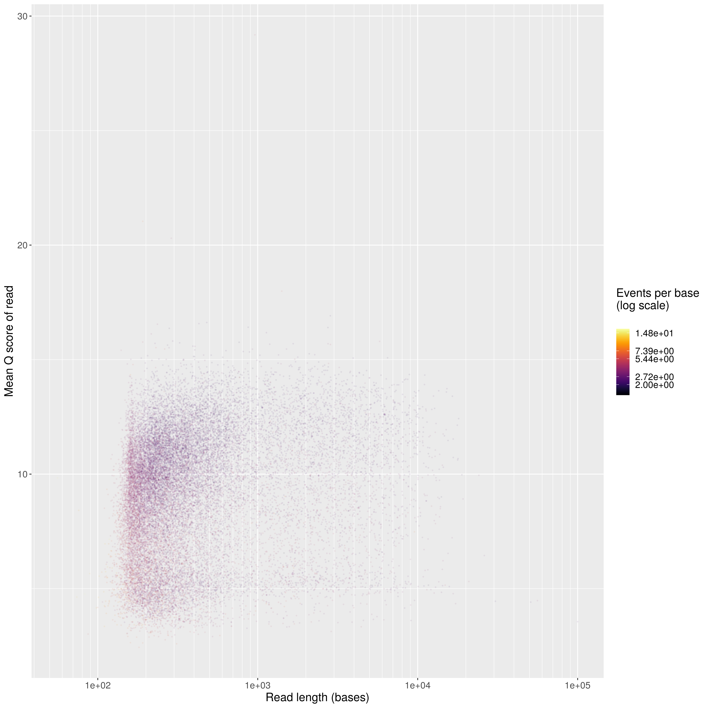
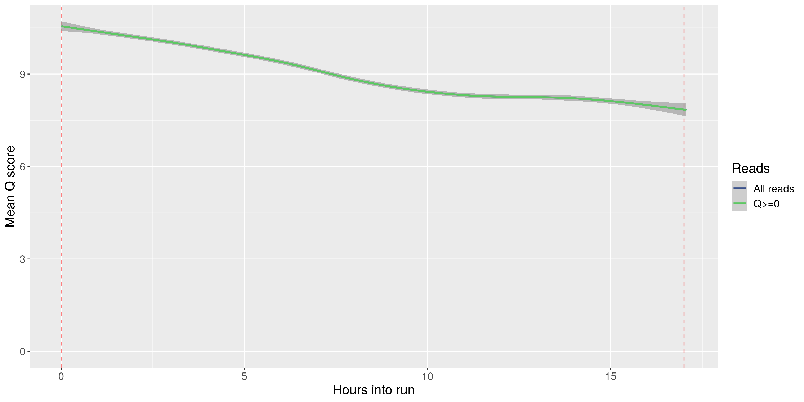
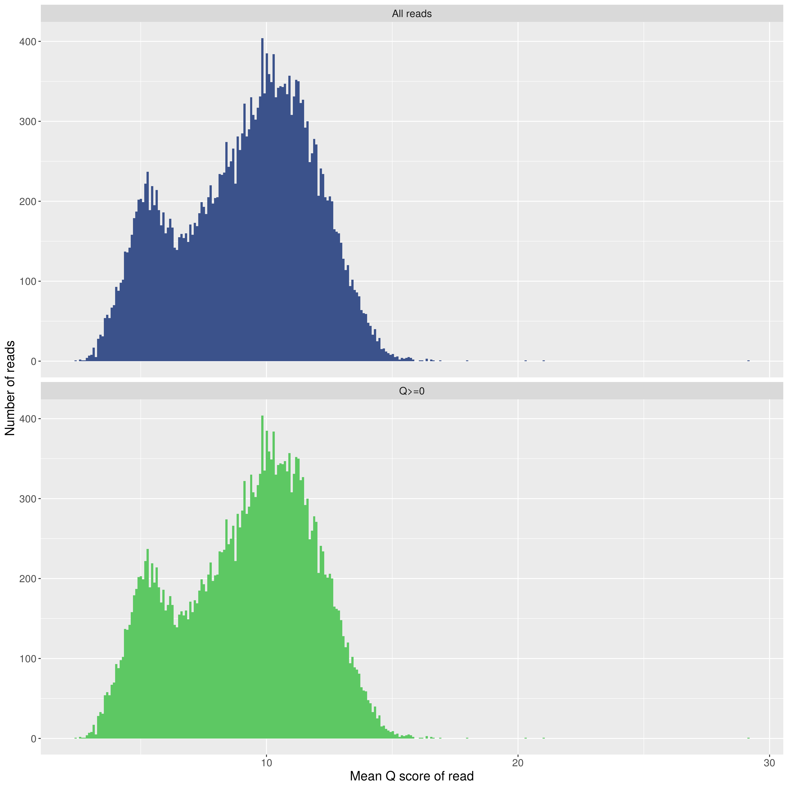
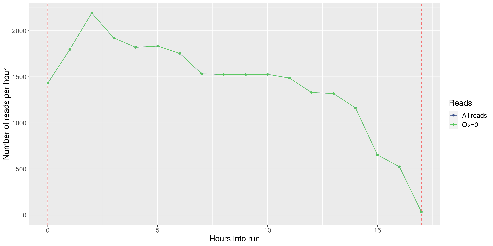
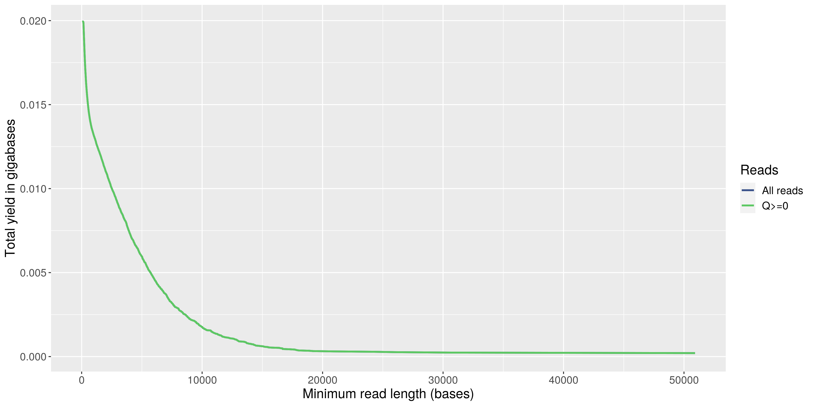
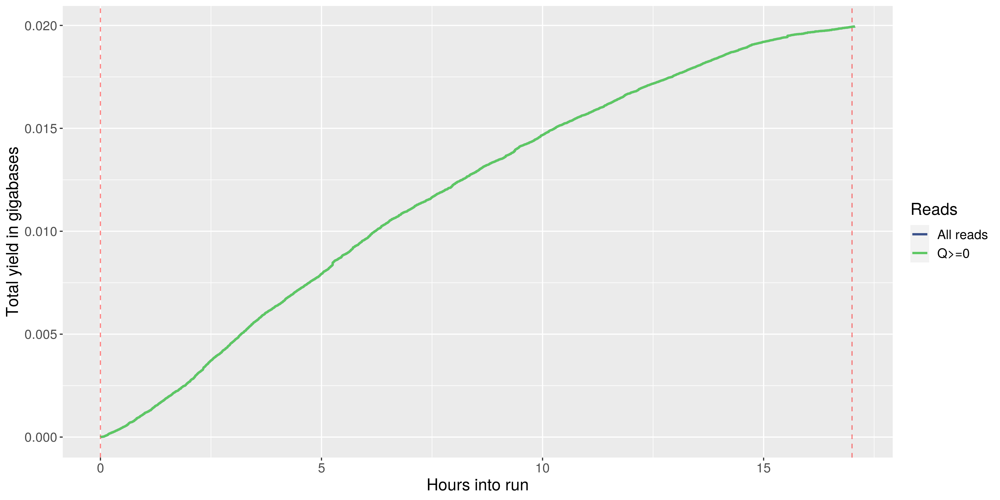

======================================
Oxford Nanopore Minion Quality Control
======================================

:Author: Michael Hall
:Date:   06/28/2022

.. raw:: html

**Arabidopsis Thalania**

Standard Workflow
=================
   
.. code:: shell

**MinionQC**

   **Clone the Github Repository**

   git clone https://github.com/PBGLMichaelHall/MinionQC.git

   **Change Working Directory**

   cd/ MinionQC

   **Create a new enviroment**

   mamba env create --file env/MinionQCenv.yaml

   **Activate new Environment**

   conda activate MinionQC

   **Run Minion R Script**

   Rscript Minion_R_QC_Script/MinIONQC.R -i summary/sequencing_summary.txt -q 0

Data Tree Structure
===================

.. code:: shell

   (base) michael@mh-ubuntu:~/Desktop/Arabidopsis_Thalania_Run00123$ tree
   .
   ├── fast5
   │   ├── AJI658_535642224ed16dcaf6e8cab4fc0ebb5f60ddaf03_0.fast5
   │   ├── AJI658_535642224ed16dcaf6e8cab4fc0ebb5f60ddaf03_10.fast5
   │   ├── AJI658_535642224ed16dcaf6e8cab4fc0ebb5f60ddaf03_11.fast5
   │   ├── AJI658_535642224ed16dcaf6e8cab4fc0ebb5f60ddaf03_12.fast5
   │   ├── AJI658_535642224ed16dcaf6e8cab4fc0ebb5f60ddaf03_13.fast5
   │   ├── AJI658_535642224ed16dcaf6e8cab4fc0ebb5f60ddaf03_14.fast5
   │   ├── AJI658_535642224ed16dcaf6e8cab4fc0ebb5f60ddaf03_15.fast5
   │   ├── AJI658_535642224ed16dcaf6e8cab4fc0ebb5f60ddaf03_16.fast5
   │   ├── AJI658_535642224ed16dcaf6e8cab4fc0ebb5f60ddaf03_17.fast5
   │   ├── AJI658_535642224ed16dcaf6e8cab4fc0ebb5f60ddaf03_18.fast5
   │   ├── AJI658_535642224ed16dcaf6e8cab4fc0ebb5f60ddaf03_19.fast5
   │   ├── AJI658_535642224ed16dcaf6e8cab4fc0ebb5f60ddaf03_1.fast5
   │   ├── AJI658_535642224ed16dcaf6e8cab4fc0ebb5f60ddaf03_20.fast5
   │   ├── AJI658_535642224ed16dcaf6e8cab4fc0ebb5f60ddaf03_21.fast5
   │   ├── AJI658_535642224ed16dcaf6e8cab4fc0ebb5f60ddaf03_22.fast5
   │   ├── AJI658_535642224ed16dcaf6e8cab4fc0ebb5f60ddaf03_23.fast5
   │   ├── AJI658_535642224ed16dcaf6e8cab4fc0ebb5f60ddaf03_24.fast5
   │   ├── AJI658_535642224ed16dcaf6e8cab4fc0ebb5f60ddaf03_25.fast5
   │   ├── AJI658_535642224ed16dcaf6e8cab4fc0ebb5f60ddaf03_2.fast5
   │   ├── AJI658_535642224ed16dcaf6e8cab4fc0ebb5f60ddaf03_3.fast5
   │   ├── AJI658_535642224ed16dcaf6e8cab4fc0ebb5f60ddaf03_4.fast5
   │   ├── AJI658_535642224ed16dcaf6e8cab4fc0ebb5f60ddaf03_5.fast5
   │   ├── AJI658_535642224ed16dcaf6e8cab4fc0ebb5f60ddaf03_6.fast5
   │   ├── AJI658_535642224ed16dcaf6e8cab4fc0ebb5f60ddaf03_7.fast5
   │   ├── AJI658_535642224ed16dcaf6e8cab4fc0ebb5f60ddaf03_8.fast5
   │   └── AJI658_535642224ed16dcaf6e8cab4fc0ebb5f60ddaf03_9.fast5
   └── guppy_out
   ├── fail
   │   ├── fastq_runid_535642224ed16dcaf6e8cab4fc0ebb5f60ddaf03_0_0.fastq
   │   ├── fastq_runid_535642224ed16dcaf6e8cab4fc0ebb5f60ddaf03_1_0.fastq
   │   ├── fastq_runid_535642224ed16dcaf6e8cab4fc0ebb5f60ddaf03_2_0.fastq
   │   ├── fastq_runid_535642224ed16dcaf6e8cab4fc0ebb5f60ddaf03_3_0.fastq
   │   ├── fastq_runid_535642224ed16dcaf6e8cab4fc0ebb5f60ddaf03_4_0.fastq
   │   ├── fastq_runid_535642224ed16dcaf6e8cab4fc0ebb5f60ddaf03_5_0.fastq
   │   └── fastq_runid_535642224ed16dcaf6e8cab4fc0ebb5f60ddaf03_6_0.fastq
   ├── guppy_basecaller-core-dump-db
   │   ├── attachments
   │   ├── completed
   │   ├── new
   │   ├── pending
   │   └── settings.dat
   ├── guppy_basecaller_log-2022-05-23_12-49-31.log
   ├── guppy_basecaller_log-2022-05-23_18-21-02.log
   ├── guppy_out
   │   ├── guppy_basecaller-core-dump-db
   │   │   ├── attachments
   │   │   ├── completed
   │   │   ├── new
   │   │   ├── pending
   │   │   └── settings.dat
   │   ├── guppy_basecaller_log-2022-05-23_12-49-21.log
   │   └── sequencing_summary.txt
   ├── pass
   │   ├── fastq_runid_535642224ed16dcaf6e8cab4fc0ebb5f60ddaf03_0_0.fastq
   │   ├── fastq_runid_535642224ed16dcaf6e8cab4fc0ebb5f60ddaf03_1_0.fastq
   │   ├── fastq_runid_535642224ed16dcaf6e8cab4fc0ebb5f60ddaf03_2_0.fastq
   │   ├── fastq_runid_535642224ed16dcaf6e8cab4fc0ebb5f60ddaf03_3_0.fastq
   │   ├── fastq_runid_535642224ed16dcaf6e8cab4fc0ebb5f60ddaf03_4_0.fastq
   │   ├── fastq_runid_535642224ed16dcaf6e8cab4fc0ebb5f60ddaf03_5_0.fastq
   │   └── fastq_runid_535642224ed16dcaf6e8cab4fc0ebb5f60ddaf03_6_0.fastq
   ├── sequencing_telemetry.js
   └── summary
       ├── MinIONQC.R
        └── sequencing_summary.txt

   16 directories, 49 files
   
   
   
Guppy Basecaller Log Standard Output
====================================

.. code:: shell

   
   2022-05-23 12:49:31.950838 [guppy/message] ONT Guppy basecalling software version 5.0.17+99baa5b27
   config file:        /opt/ont/guppy/data/dna_r9.4.1_450bps_hac.cfg
   model file:         /opt/ont/guppy/data/template_r9.4.1_450bps_hac.jsn
   input path:         fast5/
   save path:          guppy_out/
   chunk size:         2000
   chunks per runner:  256
   minimum qscore:     9
   records per file:   4000
   fastq compression:  ON
   num basecallers:    1
   cpu mode:           ON
   threads per caller: 4

Conda/Mamba Environment Preview
===============================
   
.. code:: yaml 
   
   name: MinionQC

   channels:
     - default
     - bioconda
     - conda-forge
     - r

   dependencies:
     - r-data.table
     - r-futile.logger
     - r-ggplot2
     - r-optparse
     - r-plyr
     - r-readr
     - r-reshape2
     - r-scales
     - r-viridis
     - r-yaml
  

Standard R Script Output
========================

.. code:: shell

   mamba env create --file MinionQCenv.yaml
   
   conda activate MinionQC
   
   Rscript MinIONQC.R -i sequencing_summary.txt -q 0
   
   
   INFO [2022-06-28 10:59:29] Loading input file: sequencing_summary.txt
   INFO [2022-06-28 10:59:30] MinION flowcell detected
   INFO [2022-06-28 10:59:30] .: creating output directory:.
   INFO [2022-06-28 10:59:30] .: summarising input file for flowcell
   INFO [2022-06-28 10:59:30] .: plotting length histogram
   INFO [2022-06-28 10:59:32] .: plotting mean Q score histogram
   INFO [2022-06-28 10:59:33] .: plotting flowcell overview
   INFO [2022-06-28 10:59:39] .: plotting flowcell yield over time
   INFO [2022-06-28 10:59:40] .: plotting flowcell yield by read length
   INFO [2022-06-28 10:59:41] .: plotting sequence length over time
   INFO [2022-06-28 10:59:44] .: plotting Q score over time
   INFO [2022-06-28 10:59:46] .: plotting reads per hour
   INFO [2022-06-28 10:59:47] .: plotting read length vs. q score scatterplot
   INFO [2022-06-28 10:59:49] .: plotting flowcell channels summary histograms
   INFO [2022-06-28 10:59:50] .: plotting physical overview of output per channel

Figures/Plots
=============

.. figure:: ../images/flowcell_overview.png

::

